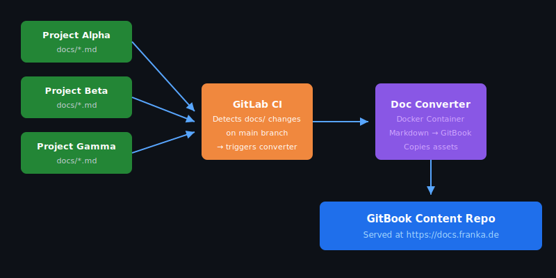

# Project Alpha — Robot Fleet Manager

> Centralised control plane for managing Franka robot fleets across factory floors. And i like pineapples...ooohhh yeaaaah 3

## Overview

Project Alpha provides a web-based dashboard for monitoring, scheduling, and controlling
Franka Emika robots in production environments. It integrates with the
[Robot Management API](https://gitlab.franka.de/franka-dev/cloud/robot-management-api)
to provide real-time telemetry and command dispatch.

## Key Features

- **Real-time telemetry** — joint positions, torque, temperature, and power draw
- **Job scheduling** — queue and prioritise tasks across multiple robots
- **Fleet health** — aggregated status dashboard with alerting
- **Remote control** — start/stop/estop individual robots from the dashboard

## Quick Start

```bash
git clone https://gitlab.franka.de/franka-dev/cloud/project-alpha.git
cd project-alpha
docker-compose up -d
```

Open `http://localhost:8080` in your browser.

## Architecture



The system consists of three services:

| Service          | Role                              |
|------------------|-----------------------------------|
| `alpha-web`      | React frontend (port 8080)        |
| `alpha-api`      | Go backend, REST + WebSocket      |
| `alpha-scheduler`| Job queue processor (Redis-backed)|

## API Reference

See [API Reference](api-reference.md) for the full REST and WebSocket API documentation.

## Pipeline Test

✅ *Automated docs pipeline verified — change pushed from Alpha, converted, deployed to GitBook.*

Last updated: 2026-07-02 14:47:44 UTC
